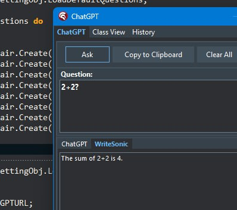
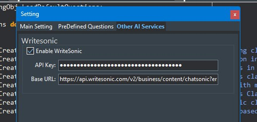

# ChatGPTWizard

 
 

<h2>An OpenAI plug-in for Embarcadero RAD Studio IDE.</h2>

<h3>First Plugin Ever to support ChatGPT & Writesonic!</h3>
 

## Demo

Short1(ChatGPT)

Short2(Writesonic)

Long

 

## Platforms

This Plugin Supports the following AI Services:

### [ChatGPT](https://chat.openai.com/chat)

[generate API Key here](https://beta.openai.com/account/api-keys)

### [Writesonic](https://writesonic.com)

[generate API Key here](https://docs.writesonic.com/reference/finding-your-api-key)

**NOTE: Other AI Services(non-ChatGPT) are enabled in Rad Studio 10.2 and above!**

## Remarks

- It's compatible with Xe5 and later versions.
- Uses XSuperObject library which is included in the project files. you can also find the latest version [here](https://github.com/onryldz/x-superobject/blob/master/XSuperObject.pas)
- Settings are stored in registry which can be found here: `Computer\HKEY_CURRENT_USER\Software\ChatGPTWizard`
- Consider that if you run it in the IDE without opening any project it will raise a message that it cannot load the SSL library. for more details see [here](#issues-with-ssl)

 

## How to Install

Open the project, right-click on the project in the project manager, build, and install.

 

## How to Use

### **Plug-in's main form**

You can use the ChatGPT menu from the IDE's main menu directly to ask questions and get the answer.
Click on the newly added ChatGPT menu on the IDE(or press Ctrl+Shidt+Alt+C) to open the wizard, type the question and press the Ask button(or Ctrl+Enter).

 

 

**A New Tab has been added to get a separate result for Writesonic.**

So now you are able to get two different answers based on any question, compare, merge and get the best quality with codes.

 

 

### **Settings**

**"Other AI Services"** Tab is responsible for setting up Other AI service's tokens including Writesonic's credentials.

 

 

## Inline Questions

If you need to use the ChatGPT inside the editor you need to type a question directly inside the code editor and surround it with "cpt:" at the beginning and ":cpt" at the end of the question then press Ctrl+Shift+Alt+A or simply select "Ask" from the editor's context menu by right-clicking on the selected text.

 

## Dockable Form

Use the "ChatGPT Dockable" menu from the main menu to show the dockable form and try to dock the form to the left or right side panel of the IDE, and enjoy with your new Google killer assistant!
 

 

## Class View

Using the class view you have your class list with some functionalitis in a popup menu.
It is also possible to use your custom command based on the selected class in the TreeView, in this case @Class will represent the selected class
in your custom command, if you don's use @Class the selected class' source will be attached to the end of your command, just pay attention there will be 
some limitations, because at the moment it's not possible to send thousand of lines through the API request.

Please mind that it is best to use this feature for small classes. due to API limitation you cannot send a class with several thousand lines of code in a question.

 

 

## History

History is available if you enable it in the setting form, it's using SQLite as a simple file base database.
You can find an empty database in Resource\DB that named "History.sdb", copy this file to any place in the disk and address to the folder in the setting.

 

 

 

## Search in History

Right click on the History grid and check search item to the search bar appears, it's not visibile by default to save some space, finally type the keyword
to search and filter, there are two checkboxes as extra options like case sensitive and fuzy match string search.

 

 

 

 

## Issues with SSL

This issue can be fixed if you put SSL libraries(can find them in the resource folder) alongside the `bds.exe` or in Bpl folder(mine is `C:\Users\Public\Documents\Embarcadero\Studio\22.0\Bpl`)
or you can use a build event on the project's properties to copy these two class libraries if they don't exist.
Another thing is, You don't have to do that because it will work fine when you open any project in the IDE before using this plugin! I'm not sure that this behavior depends on the installed components or libraries or if the IDE loads SSL libraries at the moment you open even a new application. although using the plugin when you are working on a project seems more useful anyways.

 

## Usage Scenario

Open a new `vcl` applicatiopn project, add a new unit and remove all the code from it! and type the following line, 
select all and press `Ctrl+Shift+Alt+A`.

`cpt:Create a full unit in Delphi including a class to create an XML file.:cpt`

 

 

**Presentation: [ChatGPT wizard.pptx](https://github.com/AliDehbansiahkarbon/ChatGPTWizard/files/10612086/CHAtGPT.wizard.pptx)**

**Good luck!**
